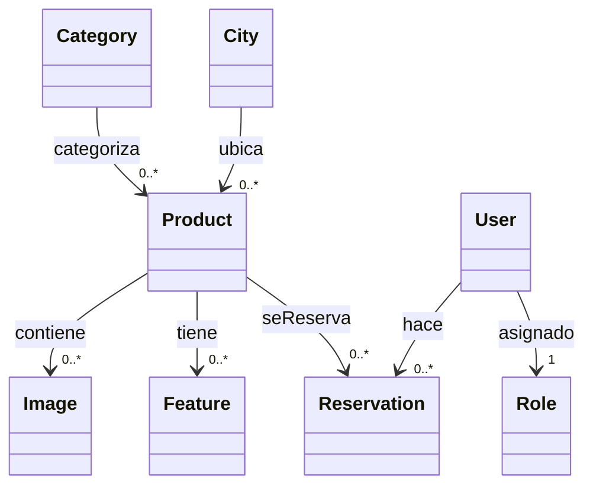
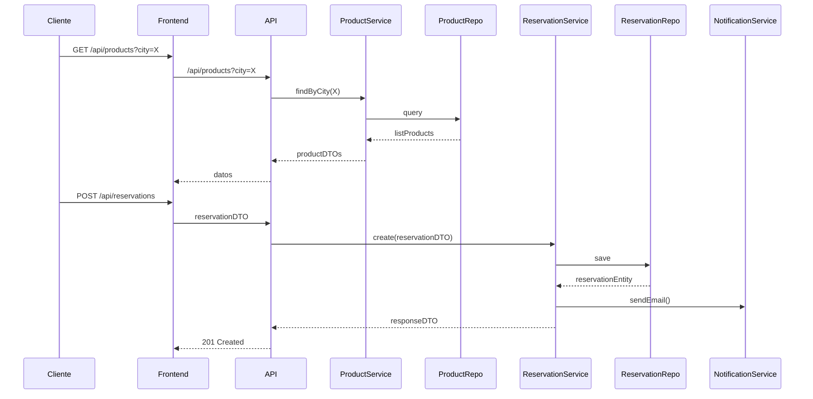

# Software Design Description
## Sistema de Reserva de Alojamientos

Version 1.1  
Preparado por:
 Laura Victoria Ramos Agudelo- 1017156571- laura.ramos@udea.edu.co Andrea Marin Diaz - 1001416396 - andrea.marind@udea.edu.co 
Yiyi Alejandra Lopez Torres - 1000257988 - yiyi.lopez@udea.edu.co 
Darwin Andrés Tangarife Avendaño - 1017137654 - darwin.tangarife@udea.edu.co  
Universidad de Antioquia – Ingeniería de Sistemas  
Fecha de creación: 10 de mayo de 2025  

Table of Contents
=================
* [Historial de Revisiones](#historial-de-revisiones)
* 1 [Introducción](#1-introducción)
  * 1.1 [Propósito del Documento](#11-propósito-del-documento)
  * 1.2 [Alcance del Producto](#12-alcance-del-producto)
  * 1.3 [Definiciones, Acrónimos y Abreviaturas](#13-definiciones-acrónimos-y-abreviaturas)
  * 1.4 [Referencias](#14-referencias)
  * 1.5 [Visión General del Documento](#15-visión-general-del-documento)
* 2 [Especificación Funcional](#2-especificación-funcional)
  * 2.1 [Requisitos Funcionales](#21-requisitos-funcionales)
  * 2.2 [Requisitos No Funcionales](#22-requisitos-no-funcionales)
* 3 [Diseño Arquitectónico](#3-diseño-arquitectónico)
  * 3.1 [Preocupaciones de los Stakeholders](#31-preocupaciones-de-los-stakeholders)
  * 3.2 [Justificación de Diseño](#32-justificación-de-diseño)
* 4 [Diseño Detallado](#4-diseño-detallado)
  * 4.1 [Vista Estática](#41-vista-estática)
  * 4.2 [Vista Dinámica](#42-vista-dinámica)
* 5 [Patrones de Diseño Utilizados](#5-patrones-de-diseño-utilizados)
* 6 [Apéndices](#6-apéndices)

## 1 Introducción

### 1.1 Propósito del Documento
Describir el diseño completo del sistema de reserva de alojamientos, incluyendo requerimientos, arquitectura y detalles de implementación extraídos del código fuente.

### 1.2 Alcance del Producto
- Búsqueda y filtrado de alojamientos por ciudad.  
- Gestión de usuarios con roles (ADMIN, USER).  
- CRUD de categorías, ciudades, características, imágenes, alojamientos (products).  
- Gestión de reservas con fechas de check-in/check-out.  
- Autenticación y autorización JWT.  

### 1.3 Definiciones, Acrónimos y Abreviaturas
- **JWT:** JSON Web Token  
- **DTO:** Data Transfer Object  
- **CRUD:** Create, Read, Update, Delete  
- **API:** Interfaz de Programación de Aplicaciones  

### 1.4 Referencias
- Anteproyecto – Sistema de Reserva de Alojamientos (UdeA, 2025)  
- Spring Boot 2.7.  
- React 18.  
- Google Maps Platform API.  

### 1.5 Visión General del Documento
Se presenta la especificación funcional, arquitectura, diseño estático y dinámico, patrones y apéndices con diagramas y endpoints.

## 2 Especificación Funcional

### 2.1 Requisitos Funcionales
- **RF1:** Gestión de categorías (GET, POST, PUT, DELETE /api/categories).  
- **RF2:** Gestión de ciudades (/api/cities).  
- **RF3:** Gestión de características de alojamientos (/api/features).  
- **RF4:** Gestión de imágenes (/api/images).  
- **RF5:** Gestión de alojamientos (/api/products).  
- **RF6:** Gestión de reservas (/api/reservations).  
- **RF7:** Registro y autenticación de usuarios (/api/users, /api/auth).  
- **RF8:** Asignación de roles y gestión de usuarios (/api/roles).  

### 2.2 Requisitos No Funcionales
- **RNF1:** <200 ms en peticiones simples.  
- **RNF2:** Escalabilidad para 500 conexiones simultáneas.  
- **RNF3:** Seguridad OWASP Top 10.  
- **RNF4:** Base de datos MySQL en producción; H2 en pruebas.  

## 3 Diseño Arquitectónico

Sistema monolítico modular con capas:

- **Controller Layer:** Exposición de endpoints REST (paquete controllers).  
- **Service Layer:** Lógica de negocio (service).  
- **Repository Layer:** Persistencia con Spring Data JPA (repository).  
- **Model/DTO:** Entidades JPA y mapeo con DTO.  
- **Security:** JWT filters en paquete security / config.  

### 3.1 Preocupaciones de los Stakeholders
- Usuarios: rapidez en búsquedas y reservas.  
- Admin: mantenimiento sencillo de datos.  
- Operaciones: robustez y trazabilidad de reservas.  

### 3.2 Justificación de Diseño
- **Spring Boot:** Productividad y ecosistema maduro.  
- **DTO Pattern:** Separación de entidades y exposición de datos.  
- **Spring Data JPA:** Simplificación de accesos a datos.  
- **JWT:** Gestión stateless de sesiones.  
- **Mermaid para diagramas:** Facilita edición y versión de diagramas.  

## 4 Diseño Detallado

### 4.1 Vista Estática

**Modelos clave**:  
- **Category**: id, title, description, imageUrl, productList.  
- **City**: id, name, country, state, productList.  
- **Product**: id, title, shortDescription, longDescription, location, latitude, length, opinion, star, subtitle, policy, rules, safetySecurity, address, category, city.  
- **Reservation**: id, checkIn, checkOut, product, user.  
- **User**: id, name, lastName, email, password, role.  

### 4.2 Vista Dinámica

**Flujo de reserva**:

## 5 Patrones de Diseño Utilizados

- **DTO:** Desacoplamiento de entidad y modelo de datos expuesto.  
- **Repository (Spring Data):** Abstracción de persistencia.  
- **Singleton:** Beans de servicios y configuración gestiona un solo instance.  
- **Factory Method:** Configuración de JWT y seguridad en AppConfig.  
- **Strategy:** Cálculo de tarifas dinámico según políticas.  

## 6 Apéndices

- **A. Endpoints REST completos**  
- **B. Diagrama de despliegue**  
- **C. Configuración application.properties**  
